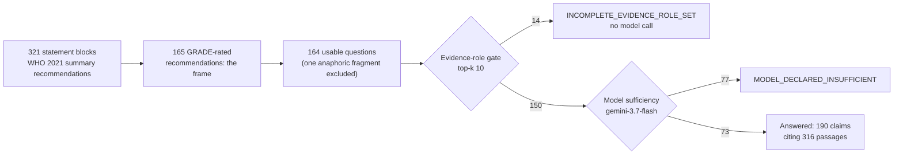
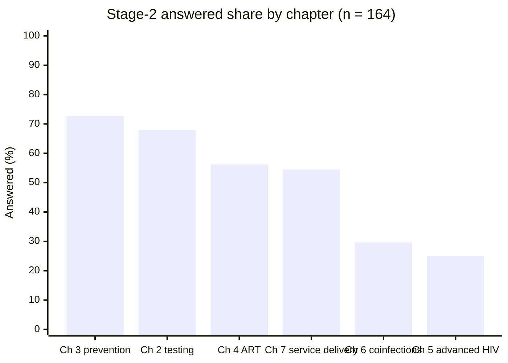

<div align="center">

# Sentinel RAG

**A fail-closed, provenance-bound retrieval and answer system for infectious disease practice guidelines**

*Research artifact. Not authorized for patient care. Do not enter protected health information.*

[](docs/roadmap.md)
[](LICENSE)
[](apps/api/pyproject.toml)
[](package.json)
[](#96-checks)
[](docs/corpus-steward.md)
[](#9-reproducibility)

</div>

---

## Summary

Sentinel RAG answers clinical questions from WHO HIV practice guidelines under one invariant: a
claim reaches the reader only with an authenticated source artifact, an exact locator, a signed
corpus release, and a deterministic policy that fails closed at every stage. The system is built
over one real corpus, the WHO SMART Guidelines Digital Adaptation Kit (DAK) for HIV, and is then
measured against what that corpus can answer rather than against a retrieval score.

Two headline numbers describe the same system and measure different things:

| Measurement | Value | What it measures |
|---|---:|---|
| Retrieval benchmark, 430 sealed cases | **0.9647** | Near-duplicate lookup. The queries are normalized fragments of the corpus's own text, so this is not a clinical retrieval claim ([§7.1](#71-retrieval-benchmark-development-suite)) |
| Clinical answerable coverage, pre-registered | **0.4631** | The share of recommendations in the corpus's parent guideline for which the system renders an answer with claims ([§7.2](#72-answerable-coverage-pre-registered-two-stage-measurement)) |

Four findings changed a design decision, and all four are negative and reproducible:

- **40.4% of the release is exact duplicate content** that content hashing could not see. Across four WHO kits the duplication is specific to HIV while the blindness is general ([§7.3](#73-corpus-structure-findings)).
- **91.0% of records labelled recommendation-bearing cannot bear a recommendation.** The defect holds across four kits at 29 to 81% ([§7.3](#73-corpus-structure-findings)).
- **A cross-encoder reranker made ranking worse.** The truncation explanation was tested at double the token budget and refuted ([§7.4](#74-reranking-measured-and-rejected)).
- **Switching the entire safety chain off changes coverage by one question in 49.** The chain is nearly free, and on this corpus it is also largely untested ([§7.7](#77-what-the-safety-chain-costs-measured-against-itself)).

Every number in this document recomputes from the runs committed in
[benchmarks/results/](benchmarks/results/): sealed retrieval reports verbatim with verifiable
digests, and coverage runs with corpus text redacted and every measured field intact. A checker
fails the build if the prose and the runs disagree ([§9.6](#96-checks)).

Start with [reproducibility](#9-reproducibility), the [architecture](#3-system-architecture), the
[design decisions](#6-design-decisions-and-their-rationale), or the
[limitations](#8-threats-to-validity-and-known-limitations).

---

## Abstract

Retrieval-augmented generation over clinical guidelines is usually evaluated as a retrieval problem
and deployed as a text-generation product. This repository takes the opposite position: the hard
part is refusing to answer, and the contribution is an end-to-end chain in which every rendered
clinical claim is bound by construction to an authenticated source artifact, an exact locator, a
cryptographically attested corpus release, and a deterministic safety policy that fails closed at
every stage.

The implementation instantiates that chain over the WHO SMART Guidelines DAK for HIV, from
authenticated acquisition through signed release validation, model-pinned index construction, sealed
benchmark acceptance, hybrid retrieval, and grounded answer composition. It then measures what the
corpus can answer under a pre-registered decision rule and reports that the retrieval score
(0.9647) and the clinical answerable coverage (0.4631) are measurements of two different things.

The negative results are reported in full. 40.4% of the release is exact duplicate content
invisible to content-hash deduplication; 91.0% of the records labelled recommendation-bearing
structurally cannot bear a recommendation; and coverage concentrates on the business processes the
kit operationalizes, 29.6% on coinfections and comorbidities against 67.9% on testing and diagnosis.
Each traces to a structural property of the source rather than to a ranking defect. Two of the three
were re-measured on the other WHO adaptation kits: the duplication is specific to HIV and the
labelling defect is general. A cross-encoder reranker measurably hurt and was rejected, and the
explanation that would have excused it was tested and refuted. Switching every safety mechanism off
changes coverage by one question out of 49: the chain is nearly free, and on this corpus largely
untested, because the failure it exists to prevent does not occur here.

---

## Table of contents

1. [Problem statement and scope](#1-problem-statement-and-scope)
2. [Contributions](#2-contributions)
3. [System architecture](#3-system-architecture)
4. [Technology stack, and why each part was chosen](#4-technology-stack-and-why-each-part-was-chosen)
5. [Execution environment: what runs locally, what runs in the cloud](#5-execution-environment-what-runs-locally-what-runs-in-the-cloud)
6. [Design decisions and their rationale](#6-design-decisions-and-their-rationale)
7. [Evaluation and experimental results](#7-evaluation-and-experimental-results)
8. [Threats to validity and known limitations](#8-threats-to-validity-and-known-limitations)
9. [Reproducibility](#9-reproducibility)
10. [Repository map](#10-repository-map)
11. [Work in progress: the narrative vertical](#11-work-in-progress-the-narrative-vertical)
12. [Data governance and licensing](#12-data-governance-and-licensing)
13. [Citation and references](#13-citation-and-references)

---

## 1. Problem statement and scope

A clinical guideline assistant has one catastrophic failure mode: a wrong answer carrying a real
citation. It is worse than no answer and worse than an abstention, because the provenance apparatus
that should protect the reader is what makes the wrong claim credible. Every architectural decision
in this repository follows from treating that failure as the thing to design against.

The system enforces one invariant end to end:

> A clinical claim is never rendered unless authorized evidence, exact provenance, applicability,
> counter-evidence retrieval, and every policy-required verification check pass.

**Scope.** The current vertical is WHO SMART HIV only: one validated release of 5,145 approved
records, answered end to end. Corpus breadth is deferred because build-side rigor was far ahead of
product surface, and further benchmark refinement had lower return than reading real outputs. The
product is a WHO HIV guidelines assistant, which is both the true claim and the stronger one.

**Out of scope**, and not reachable from the current state: clinical validation, clinician approval,
sealed-holdout acceptance, release activation, deployment.

---

## 2. Contributions

| # | Contribution | Detail |
|---|---|---|
| **C1** | A **two-plane architecture** separating an offline, cryptographically attested corpus build plane from a serving plane that cannot mutate corpus state, with a signed release as the only interface between them | [§3.1](#31-two-plane-separation) |
| **C2** | **Anchor-replay QA**: every evidence record's locator is replayed against preserved source bytes before the record can enter a release; any replay failure, incomplete classifier output, duplicate approved content, or empty approval set fails the release closed | [§3.3](#33-build-plane-the-corpus-steward) |
| **C3** | A **presentation-as-view** layer that makes cell-addressed spreadsheet evidence readable without re-materializing it, preserving digest, anchor, and citation stability | [D4](#d4--presentation-is-a-view-never-a-re-materialization) |
| **C4** | An **evidence-role completeness gate qualified by passage form**, which blocks generation before any model call and cannot be satisfied by evidence whose structural form cannot carry a recommendation | [D5](#d5--the-role-gate-is-qualified-by-passage-form-not-by-content-reading) |
| **C5** | A **grounded answer lane in which model output is a proposal**: the model's sufficiency signal can lower an outcome to abstention but never raise one to an answer, and a claim citing evidence outside the retrieved set is discarded whole rather than repaired | [D7](#d7--model-output-is-a-proposal-never-a-result) |
| **C6** | A **sealed benchmark contract** with a measured rather than chosen comparator floor, per-stratum Wilson lower bounds, sample mass allocated by measured discriminative headroom, and a custody-controlled holdout that remains unspent | [§7.1](#71-retrieval-benchmark-development-suite) |
| **C7** | A **pre-registered two-stage coverage measurement** whose question set is sampled from the corpus's parent guideline rather than from the corpus itself, instantiated through a published clinical-question taxonomy, with an explicit lexical-leakage screen | [§7.2](#72-answerable-coverage-pre-registered-two-stage-measurement) |
| **C8** | Three **negative structural findings** about operational guideline corpora: exact duplication invisible to content hashing, asset-level role labelling, and coverage concentrated on operationalized business processes. Two are re-measured across four WHO adaptation kits, where the duplication proves HIV-specific and the labelling defect proves general | [§7.3](#73-corpus-structure-findings) |
| **C9** | An **ablation of the safety chain against itself**, showing that it costs one answer in 49 and that its claim-grounding check has had no occasion to fire: no claim in any run cites an evidence ID outside its own retrieved set. The cost objection is answered, and the chain's own coverage is recorded as untested | [§7.7](#77-what-the-safety-chain-costs-measured-against-itself) |
| **C10** | A **record of components measured and rejected**, kept as reproducible negative results: a cross-encoder reranker that regressed ranking, a query expander whose value is not established, and a vector-store upgrade blocked by tie-order reproducibility | [§7.4](#74-reranking-measured-and-rejected), [§7.6](#76-vector-store-version-study-qdrant-1154-vs-1190) |
| **C11** | A **pre-registered correctness measurement plan** with its frozen analysis code: human labelling of every rendered claim on attribution and guideline-agreement axes, paired baselines with a noise floor, an attribution audit of the grounding check, a validated judge panel, and a corpus-side abstention oracle | [docs/correctness-measurement-plan.md](docs/correctness-measurement-plan.md) |

---

## 3. System architecture

### 3.1 Two-plane separation

```mermaid
flowchart LR
  subgraph BUILD["BUILD PLANE: corpus-steward (offline, signed)"]
    direction TB
    A[Trust root and<br/>publisher registry] --> B[Inventory<br/>reconciliation]
    B --> C[Structured source<br/>processing]
    C --> D[Evidence<br/>materialization]
    D --> E[Anchor-replay QA]
    E --> F[Index build<br/>and validation]
    F --> G[Sealed benchmark<br/>acceptance]
  end

  subgraph SERVE["SERVING PLANE: FastAPI + Next.js (online, read-only)"]
    direction TB
    H[Question] --> I[Hybrid retrieval:<br/>dense + sparse, weighted RRF]
    I --> J[Payload-integrity check<br/>against canonical evidence]
    J --> K[Presentation view and<br/>exact duplicate suppression]
    K --> L{Evidence-role<br/>completeness gate}
    L -->|incomplete| M[Abstain before<br/>any model call]
    L -->|complete| N[Grounded composition]
    N --> O{Claim-level<br/>grounding}
    O -->|survives| P[Cited claims]
    O -->|nothing survives| M
  end

  G -.->|"signed release bundle<br/>(the only interface)"| H
```



The planes run as separate process entry points. `corpus-steward`, a console script with 56
subcommands, holds every mutation of corpus state; the API holds none. No build-side command can
move the active-release pointer except the one signed activation gate, and no serving request can
write corpus state at all.

### 3.2 Authority boundary

The authority boundary is the authenticated source artifact, the canonical evidence object,
structured clinical semantics, and the deterministic safety policy. Model output is never accepted
as citation metadata or source truth.

PostgreSQL is the canonical registry (54 tables, 20 Alembic migrations). Qdrant is a rebuildable,
release-specific projection and never a source of truth: passage text is read from canonical
evidence records, the index carries only filterable metadata, and a point whose payload disagrees
with the canonical record is a corrupted index that both the serving and benchmark paths fail
closed on.

### 3.3 Build plane: the corpus steward

Each stage emits an immutable artifact and an Ed25519 attestation over it, and each has a distinct
non-zero exit status so that a signed policy block is never mistaken for a crash.

| Stage | Gate enforced | Fail-closed signal |
|---|---|---|
| **Acquisition** | Registered publisher, HTTPS domain allowlist, redirect revalidation, size limit, SHA-256 content addressing | IP literals, user info, non-HTTPS ports, cross-publisher redirects, private networks, encrypted or malformed PDFs, hash mismatch |
| **Inventory reconciliation** | Exact accounting: every configured item included or explicitly excepted, with signed, bounded exception records | Incomplete inventory |
| **Structured processing** | Bounded, non-extracting FHIR package validation; package identity, lifecycle, version, licence, controlling-narrative and dependency-closure gates | exit 5 |
| **Input resolution** | Independently preserved narrative assets and digest-verified transitive package closure | exit 6 |
| **Materialization** | Per-asset acquisition, redistribution and rendering policy; deterministic PDF-page and XLSX-row extraction with source anchors; complete coverage accounting | exit 7 |
| **Evidence QA** | Replay of every PDF/XLSX anchor against preserved bytes; immutable complete approve/quarantine decision batch; three signed release attestations | Replay failure, incomplete classification, duplicate approved content, zero approved records |
| **Index construction** | Sealed, model-pinned vector batch; bundle, PostgreSQL and QA-ledger reconciliation; exhaustive point, payload, vector, dimension and collection validation; dense and sparse self-retrieval smoke tests | Any mismatch |
| **Benchmark acceptance** | Sealed sparse/dense/hybrid ablations against a frozen comparator floor and per-stratum Wilson lower bounds | exit 8 |
| **Activation** | Signed activation decision requiring a matching, unexpired sealed-holdout acceptance record | Blocked; pointer unchanged |

QA reserves a release-specific collection name only; it creates no index and does not activate.
Index construction validates and signs, and does not activate either. Activation is one database
transaction that moves the singleton pointer, transitions release state, and emits the outbox event
together.

### 3.4 Serving plane

```text
question
  -> deterministic bounded expansion (no generative query drift)
  -> release + approval + lifecycle filtered dense/sparse search over one collection
  -> weighted RRF (k = 60) with deterministic tie-breaking and isolated lane failures
  -> payload-integrity check against canonical evidence
  -> presentation view: render, fingerprint, classify form
  -> exact duplicate suppression, then top-k selection (k = 10)
  -> evidence-role completeness gate, qualified by passage form
  -> grounded answer composition, or abstention before any model call
```

Question jobs pin the active release at submission, so an activation cannot move an in-flight
request to another corpus.

Lifecycle is a filter, never a ranking signal. `SERVABLE_LIFECYCLE_STATES` is an allowlist
containing only `EFFECTIVE`, so a state added later is excluded until someone decides it is safe to
answer from. `PARTIALLY_SUPERSEDED` is excluded because serving cannot tell which part of a record
was superseded, and a superseded edition can be near-identical in text to the current one, so
neither fusion nor duplicate suppression can be trusted to prefer the right member. The constraint
is inert on a single-version release and load-bearing once a multi-edition publisher is
materialized.

### 3.5 Safety semantics

- **Tri-state applicability.** Clinical context carries explicit *present* and *known-absent* sets.
  Silence about a required or excluded fact evaluates to `UNKNOWN`, which is not eligible for
  unconditional rendering. The synthetic cases in `data/fixtures/foundation_applicability.json`
  are executed by the safety suite to preserve this behaviour.
- **Verification coverage.** Candidate evidence must be canonical and covered by every
  evidence-scoped required check. Missing, failed, or unresolved checks all withhold the claim.
  Duplicate required checks are ambiguous and therefore fail. Evidence returned for a renderable
  claim is limited to that claim's nominated candidates.
- **No implicit equivalence.** Related measurements such as eGFR and creatinine clearance remain
  distinct unless a separately validated calculation path is introduced.
- **Abstention taxonomy.** `AbstentionReason` has seven members: `NO_EVIDENCE_RETRIEVED`,
  `NO_ACTIVE_RELEASE`, `MODEL_DECLARED_INSUFFICIENT`, `NO_CLAIM_SURVIVED_GROUNDING`,
  `GENERATION_UNAVAILABLE`, `INCOMPLETE_EVIDENCE_ROLE_SET` and `EVIDENCE_DETAIL_UNAVAILABLE`.
  `RETRIEVAL_PIPELINE_NOT_CONFIGURED` is not a member: it is a serving-status code that
  `question_service.py` emits when serving is not configured. An abstention that misreports its
  reason is treated as a correctness defect even though it withholds an answer, because it sends a
  reader to the wrong next step. A quota failure is a missing measurement, never an abstention:
  the coverage harness records it as an error with its class, excludes it from every denominator,
  and emits no wrong-answer bound while one exists.

### 3.6 Client boundary

The Next.js page and layout are server components; the interactive evidence workspace is a narrow
client boundary, with presentation panels separated from the hook that owns question submission,
SSE progress, polling fallback, and stale-run cancellation.

FastAPI's OpenAPI document is checked in and generates the TypeScript HTTP contract, consumed
through `openapi-fetch`; strict Zod schemas validate HTTP and SSE payloads at runtime. The two
layers prevent compile-time schema drift and malformed network data from being treated as trusted
UI state, and CI fails the build if the generated contract drifts from the API.

### 3.7 Backend module boundaries

| Module | Responsibility |
|---|---|
| `schemas` | Frozen, `extra="forbid"` API and domain contracts with canonical range, identity, and contradiction validation |
| `lifecycle` | Version DAG validation, conflict-safe record identity, evidence-scope currentness |
| `persistence` | Async SQLAlchemy registry models over the versioned PostgreSQL schema |
| `ingestion` | Publisher policy, safe acquisition, immutable storage, layout extraction, trust classification, quarantine |
| `semantics` | Formal tri-state eligibility and context comparison |
| `verification` | Deterministic required-check policy, duplicate-check rejection, per-evidence coverage, fail-closed gate |
| `reasoning` | Orchestration, serving retrieval, presentation view, grounded composition, ablation profiles; cannot override failed verification |
| `corpus_steward` | The entire build plane: connectors, ledgers, crypto, QA, indexing, benchmarking, narrative extraction, CLI |
| `api` | Transport and dependency wiring only |

---

## 4. Technology stack, and why each part was chosen

Every entry is a decision with a rejected alternative. The organizing constraint is the same one
that drives the architecture: anything that participates in a signed attestation must be pinnable
to exact bytes and reproducible offline. That requirement eliminates most of the convenient options
in a modern RAG stack, which is why the list is conservative.

### 4.1 Build and serving backend

| Layer | Choice | Pin | Why this, and what it displaced |
|---|---|---|---|
| Language | Python | ≥ 3.10 (CI on 3.10) | The document-extraction (PyMuPDF, openpyxl), local-inference (Torch, Transformers) and cloud-SDK ecosystems are all Python. A second language at the build/serve seam would mean implementing the anchor format twice |
| HTTP API | FastAPI + Uvicorn | `>=0.115,<1` | The OpenAPI document is generated from the same Pydantic models that validate requests, which makes "the checked-in contract must match the API" a CI-enforceable invariant. **Rejected:** Flask/Django REST, where the contract would be hand-maintained and drift invisible |
| Contracts | Pydantic v2, frozen and `extra="forbid"` | `>=2.10,<3` | An unexpected field is a rejected payload, not an ignored one, so a caller cannot smuggle state past a schema. Frozen models mean an attested content object cannot be mutated after its digest is computed. **Rejected:** dataclasses with manual validation, which cannot express the range, identity and contradiction validators the safety contracts need |
| Registry database | PostgreSQL | 16-alpine | Activation moves a singleton pointer, transitions release state, and emits an outbox event in one transaction, which needs real transactions and uniqueness constraints. **Rejected:** a document store, where "at most one active release" becomes application logic |
| ORM / migrations | SQLAlchemy 2 (async) + asyncpg, Alembic | `>=2.0,<3` | 20 revisions over 54 tables; the schema is versioned because a release signed under an older schema must remain verifiable |
| Vector store | Qdrant | **exactly 1.15.4** | Named dense and sparse vectors in one collection with server-side IDF, plus payload filtering strong enough to make the release filter a server-side concern. The version is pinned exactly and appears inside the signed index report, so an upgrade is a deliberate, re-attested act ([§7.6](#76-vector-store-version-study-qdrant-1154-vs-1190)). **Rejected:** pgvector, which has no first-class sparse lane |
| Signing | `cryptography`, Ed25519 | `>=45,<47` | Deterministic signatures, small keys, no parameter choices to get wrong. **Rejected for now:** cloud KMS/HSM; key custody is a deployment concern, and a research artifact that cannot be verified offline is worse than one with local key files |
| PDF extraction | PyMuPDF | `>=1.25,<2` | Page- and rectangle-level coordinates, which make a replayable anchor possible. Text-only extractors give no locator to replay |
| XLSX extraction | openpyxl | `>=3.1,<4` | Cell addresses, which become the `A145=…` anchor form the QA gate replays |
| Dense retrieval | Qwen3-Embedding-0.6B | revision `97b0c61…`, SHA-256-pinned | Instruction-formatted queries, last-token pooling, MRL dimension bounds; declared the deployment floor, not the intended selection. Controls retained: BGE-M3 (multilingual), MedCPT (English biomedical) |
| Sparse retrieval | Unicode BM25, Qdrant-IDF-compatible | `qdrant-bm25-unicode-v1` | Parameters derived from the release itself rather than from a generic corpus; the IDF modifier is evaluated server-side so the sparse lane is reproducible from the index alone |
| Local inference | Torch + Transformers | `torch>=2.5,<3` | Runs against verified local model bytes: the artifact manifest pins a SHA-256 over the model root, and the adapter refuses to load anything else |
| Optional CPU optimization | OpenVINO + NNCF + optimum-intel | `openvino>=2025.0` | An int8 export path exists for the dense lane; per the runtime contract an optimized runtime may not reuse the float32 vector-batch attestation and must be re-measured with a newly sealed batch |
| Generation | `anthropic[vertex]`, `anthropic` + boto3, `google-genai` | optional extras | The lane is provider-swappable through a sealed parameter file. Two platform limits are handled explicitly: automatic prompt caching is unavailable on Bedrock and Vertex, so the cache breakpoint is placed on the frozen instruction block; server-side refusal fallbacks are unavailable on both, so a refusal becomes an abstention rather than a silent retry |
| Tests / lint | pytest, pytest-asyncio, aiosqlite, ruff | `pytest>=8.3,<9` | 645 API tests, including executable safety fixtures: the applicability cases are data files run as tests, so a behaviour change breaks a test rather than a comment |

### 4.2 Web client

| Layer | Choice | Pin | Why this, and what it displaced |
|---|---|---|---|
| Framework | Next.js App Router + React | 16 / 19 | Server components by default; the interactive workspace is one narrow, explicitly marked client boundary. Evidence rendering has no reason to ship to the browser |
| Language | TypeScript, strict | 5.7 | |
| HTTP contract | `openapi-typescript` + `openapi-fetch` | 7.13 / 0.17 | Types are generated from the checked-in OpenAPI document, and CI fails if the regenerated document or types differ from what is committed. **Rejected:** a hand-written client, which is how schema drift reaches production silently |
| Runtime validation | Zod | 4.4 | The generated types are compile-time only. Zod re-validates every HTTP and SSE payload at runtime, so malformed network data cannot become trusted UI state |
| Styling | CSS Modules + design tokens | | Plain CSS with shared colour tokens rather than Tailwind, and a deliberately dense evidence-review layout. Revisit only if repeated interactive patterns justify a component system |
| Components | Radix Dialog only | 1.1 | Focus trapping and dialog ARIA are the one thing not worth hand-rolling |
| Icons / type | lucide-react; Public Sans + JetBrains Mono via `next/font` | | Self-hosted at build time; no third-party font request at runtime |
| State | A focused custom hook | | Submission, SSE progress, polling fallback and stale-run cancellation live in one hook. **Rejected:** Redux/TanStack Query; there is no shared server state yet, and the policy records the condition under which that changes |
| Tests | Vitest + Testing Library; Playwright + `@axe-core/playwright` | | Cross-browser end-to-end runs include automated accessibility assertions |

### 4.3 What is deliberately absent

| Not used | Why |
|---|---|
| A RAG framework (LangChain, LlamaIndex, Haystack) | Every stage boundary here is a signed artifact with its own schema and exit status. A framework's orchestration abstractions would sit exactly where the attestations need to be, and the framework's retriever would become the measured system |
| A hosted embedding API | A remote endpoint cannot be pinned by SHA-256 and can change underneath a sealed vector batch |
| A managed vector database | Same reason, plus the pinned-version gate: the exact server version is inside the signed report |
| An LLM in the build plane | Nothing in acquisition, materialization, QA, or indexing calls a model. Role labelling and anchoring are deterministic, which is why a release can be re-derived from source bytes |
| A cloud-hosted PostgreSQL | The registry holds nothing that needs to be shared, and a local instance keeps the build plane fully offline |

---

## 5. Execution environment: what runs locally, what runs in the cloud

The entire build plane is local by design, because its trust argument rests on being reproducible
offline from source bytes and a private key that never leaves the machine. Cloud is used for the
two things the workstation cannot do: reach a frontier generation model, and put a GPU under an
embedding model too large for CPU.

### 5.1 Local

| Runs locally | Detail |
|---|---|
| **The whole build plane** | Acquisition, inventory reconciliation, FHIR validation, materialization, anchor-replay QA, index build, validation and attestation: 56 `corpus-steward` subcommands |
| **Signing keys** | Ed25519 private keys are local files, generated by `corpus-steward keygen`, never uploaded, never committed |
| **PostgreSQL 16** | Docker Compose, named volume |
| **Qdrant 1.15.4** | Docker Compose, named volume; two throwaway instances behind a `qdrant-compat` profile for the version study |
| **Dense + sparse encoding** | Qwen3-Embedding-0.6B on CPU/fp32, about 5.4 GiB resident; Unicode BM25 with release-derived parameters |
| **Reranker experiments** | Qwen3-Reranker-0.6B, artifact-bound dynamic-int8 CPU runtime, digest-checked score cache |
| **The 430-case retrieval benchmark** | Every accepted development report was produced here |
| **The coverage runner** | Retrieval runs locally; only the generation call leaves the machine |
| **Cross-DAK structure audit** | Four WHO kits, workbook-level, no network at analysis time |
| **Web dev server, Vitest, Playwright** | |

### 5.2 Google Cloud Platform

One provider, one project, application-default credentials. No API keys exist in this repository
and none is required.

| Service | Used for | Why cloud rather than local |
|---|---|---|
| **Vertex AI** | The grounded answer lane. `claude-opus-5` is the intended production lane; `gemini-3.7-flash` is the comparator that produced the stage-1 and stage-2 coverage numbers | A frontier model cannot run on the workstation. Vertex was selected over Bedrock because the Gemini comparator reaches the same project under the same credentials. Model IDs are pinned explicitly: `gemini-flash-latest` is a floating alias, and the first two stage-1 runs recorded no model ID at all, which made their numbers unattributable |
| **Cloud Run Jobs + NVIDIA L4** | The Qwen3-Embedding 4B and 8B runtime matrix, `europe-west1`, `--no-gpu-zonal-redundancy` | These targets were sealed as `BLOCKED` in the CPU matrix. Jobs rather than Services because the work is a batch measurement with a defined end |
| **Artifact Registry** | The CUDA 12.1 benchmark image (`infra/benchmarks/Dockerfile`) | The Cloud Run L4 driver is 535.x/CUDA 12.2, so the Torch wheel is pinned to the cu121 build |
| **Cloud Storage** | Release bundle and sealed suite in; the signed runtime report out | The report round-trips through its Pydantic model and self-verifies `report_sha256`, so a corrupted or hand-edited download fails validation |
| **GitHub Actions** | CI on every branch push, not only pull requests | Feature work here runs long and lands in one merge; gating on PRs alone let a branch reach 33 commits without ever being built |

**Cost discipline.** The GPU jobs are the only paid compute in the project; they are deleted after
the run, and the two reports they produced are checked in ([benchmarks/runtime/](benchmarks/runtime/)).
The generation lane bills per call and is never invoked from a test. `scripts/ask.py` and the
research serving mode exist so that looking at an answer costs one request and consumes no
sealed-holdout claim.

**A quota constraint shaped a result.** The `anthropic-*` Vertex base-model quota is ungranted on
this project, so every coverage number in [§7.2](#72-answerable-coverage-pre-registered-two-stage-measurement)
belongs to a Gemini lane, not to the sealed Claude candidate. This is recorded as limitation L3,
and the lane comparison in that section shows why it matters.

---

## 6. Design decisions and their rationale

Each decision was taken deliberately, with the rejected alternative recorded. This section is the
entry point for a reader evaluating the design rather than running the code.

### D1 — The serving retriever is *not* the benchmark runner

`ServingRetrievalService` is separate from `RetrievalBenchmarkRunner`.

**Why.** The runner is the measured system: the accepted development report and the frozen
comparator floor were produced by that exact code path, so reshaping it to serve free-text
questions would silently invalidate comparability with every prior report. The two also have
different jobs. Serving has no gold set, needs a latency budget, and treats role completeness as a
decision that gates abstention rather than a number reported afterwards.

**Cost, accepted and recorded.** Safety behaviour is duplicated rather than shared: the
payload-integrity checks are reproduced in both paths, because failing closed on a corrupted index
is a property both need. **Known divergence:** the runner does not deduplicate, so at `top_k = 10`
it is scored on rankings that can spend up to half their depth on copies while serving is not.
Equalising it would mint a new benchmark contract and require re-measuring the comparator floor,
so it is recorded as a bounded difference.

### D2 — Qdrant is a projection; PostgreSQL is the registry

**Why.** An index is rebuildable; a citation is not. Passage text never comes from the vector store,
and a payload that disagrees with the canonical evidence record aborts the request.

**Rejected.** Storing passage text in the index for latency. The saving is real, and the failure
mode, serving text that no longer matches what the release binds, is the catastrophic case.

### D3 — Signed stage attestations with distinct exit statuses

**Why.** A pipeline that fails closed is only trustworthy if a policy block is distinguishable from
a parser crash. Exit 5 (structured processing), 6 (input resolution), 7 (materialization and
licensing) and 8 (benchmark acceptance) are recorded, signed decisions.

**Rejected.** Boolean pass/fail logging, which cannot support an audit that asks which gate
refused, under which trust-root revision, signed by whom.

### D4 — Presentation is a view, never a re-materialization

XLSX evidence is anchored per cell, so `content_exact` for a spreadsheet row is the cell-addressed
form `A145=HIV.D8 …`. That is the correct anchor, and replaying it against the workbook is what the
QA gate does, but it is unusable as passage text.

`app/reasoning/presentation.py` parses that form back into cells and derives three determinations
about existing content:

1. a rendering under the publisher's own column labels, read from the release's own approved
   header rows where they survived QA and declared where they did not;
2. a fingerprint over the substantive cells, which lets a verbatim copy collapse onto the row it
   copies;
3. a classification of form (data-dictionary entry, decision rule, schedule entry, indicator,
   header, caption, section title, narrative), decided from structure and never from a role label.

**Why a view.** `content_exact`, anchors, and evidence digests are what the QA ledger decided on and
what the signed release binds. A record re-materialized to read better would invalidate both.
Citation stays bound to `evidence_id`, and the immutable content is carried alongside the view.

### D5 — The role gate is qualified by passage *form*, not by content reading

`REQUIRED_ANSWER_ROLES` is `(PRIMARY_SUPPORT, APPLICABILITY)`. The corpus assigns roles by source
asset, not by content, so a code-list entry defining `DTG` as an input option, a row of column
headings, and a section title all arrive labelled `PRIMARY_SUPPORT`.

Serving therefore counts `PRIMARY_SUPPORT` only from a passage whose form can carry a
recommendation at all; an unrecognised table cannot, because the view cannot tell what it is and the
gate exists to fail closed. Disqualified role claims are reported, so an answer withheld because of
the corpus's labelling says so.

**Deliberately not fixed at source.** `evidence_roles` is inside `CorpusEvidenceRecord`, so
re-deciding it changes every affected evidence digest and therefore the manifest, the release, the
index, and the comparability of every benchmark report produced against it. That is a re-release,
and it should be done once, alongside narrative materialization.

**Stated limit.** The gate proves completeness of kind, never of subject, and cannot be made to
prove subject without becoming a relevance judgement, that is, a model deciding what evidence
means. What protects the reader instead is claim-level grounding (D7).

### D6 — Deterministic query expansion, and it is not uniformly positive

Expansion is bounded and deterministic, with no generative query drift. Measured across six paired
runs it rescued one question and broke another: it lifted the relevant dolutegravir–metformin
interaction rule from rank 19 to rank 10, and it displaced the single passage stating the 6-month
and 12-month viral-load intervals on the one question this corpus answers well. Its value is not
established, and this is recorded rather than resolved by tuning.

### D7 — Model output is a proposal, never a result

- No retrieved evidence means abstention decided before any model call.
- Every claim must cite evidence IDs drawn from the set retrieved for that question; a claim citing
  anything else is discarded whole rather than repaired.
- If nothing survives, the result is an abstention even when the model reported sufficient evidence.
- The model's sufficiency signal can lower an outcome to abstention but never raise one to an
  answer, because a model given insufficient context answers more confidently, not less.
- A provider refusal becomes an abstention rather than a silent retry against a different model.

The lane is provider-swappable through a sealed parameter file (Anthropic on Vertex or Bedrock; a
Gemini comparator on the same Vertex project), so changing provider is a configuration change.

### D8 — The evaluation question set may not come from the corpus

**Why.** The 430-case development suite shows what happens when it does: every query is a
normalized source fragment, five strata measure query-term coverage of 1.000 by their own gold
passage, and the resulting 0.9647 measures near-duplicate lookup rather than clinical retrieval.

The coverage sampling frame is therefore the parent guideline, not the DAK. A Digital Adaptation
Kit is by definition an operationalization of a subset of its parent's recommendations, so the
fraction of parent recommendations the corpus can answer is the coverage number the decision
needs. The frame is the population of things a clinician could reasonably ask, defined by the
publisher and independent of anything built here.

**Rejected instruments**, recorded so the choice is not revisited: HIVMedQA (63 questions, about 42
distinct, licensing-exam vignettes, US exam content against guidance written for a public-health
approach; its false-premise category is retained for later abstention hardening); RealMedQA (right
method, wrong guidelines and population); MedQA, MedMCQA, PubMedQA and BioASQ (recall and literature
synthesis, not guideline lookup); the NLM Clinical Questions Collection (not obtainable; both the
stated download page and the data.gov record returned 404 on 2026-08-27).

### D9 — The comparator floor is measured, not chosen

Every acceptance gate is stated as a Wilson 95% lower bound of a measured comparator run, frozen
into a threshold policy before the candidate is evaluated, with a `comparator_measured_at`
timestamp that must precede the policy. The non-inferiority margin is 0.02, not 0: tying a
deterministic lexical control is not evidence that a neural stack earns a 10× latency cost.

Sample mass follows measured headroom rather than uniformity. The comparator scores 1.00 on five
lexical strata and every negative stratum, so 8 of 12 strata cannot discriminate between
candidates. Those saturated strata carry 15 cases each; `PARAPHRASED_INTENT`, `TERMINOLOGY`, and
`CONFLICTING_EVIDENCE` carry 60 each.

### D10 — The sealed holdout stays unspent

Development acceptance is not clinical validation. The holdout is a one-shot, custody-controlled
resource, and acceptance binds the release, so any later corpus change voids it. Three reasons keep
it closed: the 0.6B candidate is the declared deployment floor rather than the intended selection;
the 4B/8B artifacts are not acquired for the serving path; and the first-contact findings indicate
the corpus and chunking will change before a candidate is worth freezing.

`scripts/ask.py` and the research serving mode exist so that looking at an answer never consumes a
holdout claim.

### D11 — Research serving is labelled, not faked

Setting `SERVING_ENABLED=true` serves a `VALIDATED` release without activating it. The singleton
pointer stays empty, every answer carries `serving_mode: RESEARCH_UNACTIVATED` with a null
`activated_at`, and the workspace renders "Research serving, not clinically accepted" rather than
the shield and activation date an activated release earns. Per-record guarantees are unchanged:
approval status, digest agreement, servable lifecycle, and the licence conjunction behind
`render_allowed` run the same code either way.

### D12 — The rendering licence is a decision, recorded

`render_allowed: false` on every WHO asset gated three distinct acts together. They are separated
and decided independently ([docs/rendering-licence.md](docs/rendering-licence.md)):

| Act | What it reproduces | Decision |
|---|---|---|
| **Locator**: "Annex A, `HIV.D` worksheet, row 145, column E" | Nothing; a coordinate | Not a copyright act; shipped |
| **Passage**: `content_exact` or its presentation rendering | A short excerpt | Served with attribution (branch A) |
| **Page image**: a PDF page with the anchor region highlighted | A full page, and for this corpus a table | Blocked pending a WHO permissions request |

The corpus's tabular nature separates acts 2 and 3: WHO's publishing policy treats figures, tables,
maps and photos as requiring explicit permission, and this release is almost entirely spreadsheet,
decision-table, and data-dictionary rows. The MVP completion criterion was narrowed in writing as a
result, from "the anchor chain terminates in a picture" to "locatable by address and quotable by
excerpt".

---

## 7. Evaluation and experimental results

Two headline measurements on the same system measure different things, and reading either as the
other is the interpretive error this section exists to prevent. Around them sit five component
studies: reranking, embedding runtime, vector-store version, the safety-chain ablation, and the
benchmark contract's own corrections. Three produced negative results that changed a decision.

### 7.1 Retrieval benchmark (development suite)

**Suite.** `who-smart-hiv-source-derived-development-v7`, contract 1.6: 430 deterministic cases over
release `CR_b6155a25415b25f3ba787b3b036da10d`, 12 safety strata, `top_k = 10`, sealed and digest-bound
(`suite_sha256 = b16a9df…`). Its holdout sibling exists only in the custody-controlled immutable
registry.

**Candidate.** Qwen3-Embedding-0.6B (dense) + BM25 Unicode (sparse), conflict-aware, weighted RRF.

| Metric | Result | Gate |
|---|---:|---:|
| Answerable complete-evidence rate | **0.9647** (Wilson lower 0.9343) | ≥ 0.7763 |
| Comparator floor (deterministic expanded control) | 0.8275 (Wilson 95% [0.7763, 0.8689]) | must exceed, margin 0.02 |
| Required-role recall | 0.9647 | ungated by design |
| Forbidden-evidence leakage cases | 0 | 0 |
| Candidate failure cases | 0 | 0 |
| p95 latency | 1,672.7 ms | ≤ 2,000 ms |

**Verdict: accepted on the development suite, with no blockers. This is not clinical validation.**
Evidence: [`retrieval-v7-candidate-accepted.json`](benchmarks/results/retrieval-v7-candidate-accepted.json)
and [`retrieval-v7-comparator-floor.json`](benchmarks/results/retrieval-v7-comparator-floor.json),
both digest-verifiable.

The suite was executed twice, eight minutes apart, with identical quality metrics and different
latency: hybrid p95 1,672.7 ms in the earlier run and 1,440.2 ms in the later one. The figure above
is the earlier, slower run; both are published
([`…-earlier-run.json`](benchmarks/results/retrieval-v7-candidate-accepted-earlier-run.json))
rather than merged, because quoting the faster number after the gate was cleared on the slower one
would be picking a run after the fact.

**How to read 0.9647.** The suite's queries are normalized source fragments. Measured query-term
coverage by the gold passage is 1.000 for `APPLICABILITY`, `CONTRAINDICATION`, `DOSE`, `MONITORING`,
and `NEGATION`. A high blended score on this suite is evidence that near-duplicate lookup works, not
that clinical retrieval works. The `PARAPHRASED_INTENT` stratum exists to counter this: controlled
vocabulary substitution, all source identifiers dropped, accepted only inside an IDF-weighted lexical
rank band deliberately wider than the retrieval depth. Its measured coverage is 0.411. It is not a
clinician-authored paraphrase and must not be described as one.

**Lane decomposition, on the accepted suite.** These rows come from the same report as the headline
number and are directly comparable to it:

| Lane | Answerable complete-evidence | Answerable recall@10 | Required-role recall |
|---|---:|---:|---:|
| Sparse (BM25 Unicode) | 0.9608 | 0.9686 | 0.9729 |
| Dense (Qwen3-0.6B) | 0.6824 | 0.7314 | 0.7654 |
| **Hybrid (weighted RRF)** | **0.9647** | 0.9647 | 0.9647 |

The lexical lane carries this suite almost entirely. Hybrid beats sparse alone by 0.0039, one case in
255, while the dense lane alone reaches 0.68. On a suite built from normalized source fragments that
is the expected result, and it is the sharpest evidence that 0.9647 is a statement about the
instrument rather than about clinical retrieval. It is not evidence that the dense lane is
misconfigured; that hypothesis was tested separately on the `m2-verified-rendering` branch by paired
significance testing and rejected.

**Other comparisons, measured on earlier suite revisions.** These are comparable within each row but
not to the table above, because the case mix changed underneath them ([§7.8](#78-how-the-benchmark-contract-was-corrected-four-times)).
The 275-case figures are frequently misquoted alongside the 430-case headline:

| Comparison | Suite | Measurement |
|---|---|---|
| Sparse vs dense recall | 275-case | BM25 **0.9927** vs Qwen3-0.6B **0.9291** ([report](benchmarks/results/rerank-control-pre-rerank.json)) |
| Hybrid, pre-rerank | 275-case | recall 0.9927, complete-evidence **0.9855**, required-role recall 0.9982 |
| Deterministic expansion v3 vs none | earlier | complete-evidence **0.9345 → 0.9564**, no case regressions. Positive on the benchmark, not positive on real questions (D6), and the discrepancy is the finding |
| Rebalanced sample mass | 275 → 430 | comparator **0.9000 → 0.8275** on the same baseline: the mix lowering a saturated score without changing the system |

### 7.2 Answerable coverage (pre-registered, two-stage measurement)

**Sampling frame.** 321 statement-shaped blocks extracted from *Summary recommendations* of the 2021
WHO consolidated HIV guidelines, filtered to GRADE-rated statements of at least 120 characters
containing a deontic verb, minus headings, bullet fragments and footnotes: 165 formal
recommendations. Good practice statements are excluded deliberately.

**Draw.** 50, uniform without replacement, seed `20260827`. Three items are flagged in the data
rather than silently repaired: one anaphoric fragment excluded, giving n = 49, one near-duplicate,
and two general-population advice items. The draw was not redone to reach a round number, because
replacing a drawn item is the kind of small discretion that makes a seed meaningless.

**Extension to stage 2.** Stage 2 extends the same seeded draw to 150, which is sound only if the
draw nests: the n = 150 sample's first 50 elements must be the n = 50 sample. That holds at this
frame size and is asserted at runtime rather than assumed, because it is a property of
`random.sample`'s implementation and not a documented guarantee. Membership of the pre-registered
prefix is a property of the seeded draw order. An earlier version of the emitter wrote a
chapter-sorted view under the same key, which turned the prefix into "the first 150 by chapter",
disagreed with the real draw on 26 of 165 items, and excluded two stage-1 questions; the builder now
fails if any stage-1 recommendation falls outside the prefix. All 165 frame members are authored, so
the pre-registered n = 150 and a full-frame census come from one run.

**Question construction.** Each recommendation is instantiated into one of ten generic clinical
question forms from Ely et al. (BMJ 2000): 1,396 questions observed from 152 primary-care
physicians, classified into 64 types, of which the ten published types cover about 63%. This gives
phrasing an empirical, citable basis and makes "write the situation, not the wording" structural. No
recommendation needed `NO_GENERIC_FORM`.

**Lexical-leakage screen.** Content-term overlap against the source recommendation: mean 0.447,
median 0.500, against 1.000 on five strata of the source-derived suite. Twelve questions at or above
0.60 are flagged for review rather than auto-rejected, because the metric cannot separate
unavoidable clinical nouns from real leakage.

**Pre-registered decision rule.** Stage 1 at n = 50 decides only if the answer is extreme: a Wilson
95% interval entirely below 0.25 means the corpus cannot carry the product; entirely above 0.50
means proceed as scoped. Otherwise stage 2 extends to n = 150 and the decision is made on the shape
of the correct abstentions, because a corpus answering 35% uniformly and one answering 35% while
missing all of treatment initiation are the same number and different products. `ANSWERED_WRONG`
has a separate rule: zero observed occurrences at every stage, and one occurrence stops the MVP.



**Stage 1 result (2026-08-27, n = 49).** `p_answered` = 21/49 = 0.4286, Wilson 95% [0.300, 0.567],
neither entirely below 0.25 nor entirely above 0.50, so the rule sent it to stage 2. That is the
outcome the two-stage design exists to handle.

**Stage 2 result (2026-08-29, gemini-3.7-flash).** The frame is 165, so the pre-registered n = 150
samples 91% of the population. All 165 were authored, which yields the pre-registered analysis and a
census from one run; the 15 extra questions are a superset of the protocol, not a change to it.

> **`p_answered` = 69/149 = 0.4631, Wilson 95% [0.385, 0.543]** on the pre-registered n = 150.
> Full-frame census: 73/164 = 0.4451, Wilson 95% [0.371, 0.522].
> The interval is not entirely above 0.50, so the decision rests on the shape of the abstentions.
>
> Recomputable in six lines from
> [`coverage-stage2-gemini-3.7-flash.json`](benchmarks/results/coverage-stage2-gemini-3.7-flash.json)
> and the `in_preregistered_150` flag in the question set; see
> [benchmarks/results/](benchmarks/results/).

| Outcome (full frame, n = 164) | n |
|---|---:|
| Answered, at least one claim rendered | 73 |
| `MODEL_DECLARED_INSUFFICIENT` — gate passed, model judged the passages insufficient | 77 |
| `INCOMPLETE_EVIDENCE_ROLE_SET` — blocked at the gate, no model call | 14 |
| `NO_CLAIM_SURVIVED_GROUNDING` — claims composed, none survived verification | 0 |

**The gate is not what withholds answers; the model is.** 150 of 164 cleared the role gate (pass rate
0.915, against 0.898 at stage 1) and 77 of those were refused by the model's own sufficiency
judgement, which is the division `retrieval_service` predicts in its own comment and the reason a
retrieval-only run cannot approximate this number.

**Two checks the larger sample makes possible.** The 49 stage-1 questions, re-run inside the stage-2
pass, reproduced 20/49 = 0.4082 exactly. The 115 batch-accepted questions score 53/115 = 0.4609
against the 49 usable individually-read ones at 0.4082, with heavily overlapping intervals, so the
newly authored half is not systematically easier. Lexical leakage does not predict answering
either (mean overlap 0.317 answered against 0.353 abstained), so the question set is not rewarding
itself.

**Coverage by chapter.**

| Chapter | Stage 1 | Stage 2 | Share |
|---|---:|---:|---:|
| 3 — HIV prevention | 2/3 | 8/11 | 72.7% |
| 2 — HIV testing and diagnosis | 6/7 | 19/28 | 67.9% |
| 4 — ART for people living with HIV | 3/6 | 9/16 | 56.2% |
| 7 — Service delivery | 2/3 | 12/22 | 54.5% |
| 6 — Coinfections and comorbidities | 7/24 | 21/71 | 29.6% |
| 5 — Advanced HIV disease | 0/6 | 4/16 | 25.0% |



Every cell is recomputed from the published runs by `check_readme_figures.py`, which fails if a row
is misquoted. Until 2026-09-06 it did not check the rows, and four cells were wrong: chapter 2 at
stage 1 was 6/7, not 7/7; chapter 3 was 2/3 and 8/11, not 1/3 and 6/11; chapter 7 was 2/3, not 3/3.
The prose around them described chapter 3 as falling back toward the middle when it is the
best-performing chapter. The corrected reading: chapter 3 leads at 72.7%; chapters 2, 4 and 7 sit
between 54% and 68%; and stage 2 corrects the sharpest stage-1 number, because the "0 of 6 on
advanced HIV disease" was a small-sample artifact and is 4/16 = 25.0% at the larger n. What survives
is chapter 6, the largest at 71 questions, steady at 29.6% against 7/24 = 29.2% at stage 1. The
durable finding is that the corpus underperforms on coinfections and comorbidities, not that it
answers nothing on advanced disease: this corpus operationalizes a narrow slice of its parent, and
that is not a retrieval defect.

Eight of the 164 are general-population physical-activity recommendations carried in chapter 6 of
the parent guideline; the DAK operationalizes none of them and all eight abstain. Excluding them
gives 73/156 = 0.4679.

**Lane conditionality.** The same 49 questions scored **0.490 on gemini-2.5-flash against 0.408 on
gemini-3.7-flash**, a difference not significant at that n (McNemar exact p = 0.219), and a reason to
treat any single-lane coverage figure as lane-conditional rather than as a property of the corpus.

**Three limits the number cannot be read past.** No question has been classified into the
correctness buckets, so 0.4631 means "the system rendered claims", not "the system answered
correctly"; the abstentions are not split into `ABSTAINED_CORRECT` and `ABSTAINED_AVOIDABLE`; and
the run used a Gemini lane, not the sealed Claude candidate, because the `anthropic-*` Vertex
base-model quota is ungranted. The pre-registered plan for closing the first two limits is
[docs/correctness-measurement-plan.md](docs/correctness-measurement-plan.md).

The residual wrong-answer rate is reported as a bound, never as zero: with no occurrences, the
one-sided 95% upper bound is about 5.9% at n = 49 and 2.0% at n = 150. This is a screening
measurement that can detect a bad system, not one that can certify a good one.

### 7.3 Corpus structure findings

Three properties of an operational guideline corpus, each measured on the full release, each with a
consequence for system design.

F1 and F2 were first measured on one release and then re-measured on the published annexes of four
WHO adaptation kits (HIV, antenatal care, family planning, tuberculosis), so that each can be stated
as a property of the artifact class or denied it. The cross-kit measurement is pre-QA and
workbook-level, a different denominator from the release-level numbers below, and is reported as
such ([scripts/audit_dak_structure.py](scripts/audit_dak_structure.py)).

**F1: 40.4% of the release is exact duplicate content that content hashing could not see.** The
Annex A `all` worksheet is a verbatim copy of all thirteen topic worksheets with one extra column
recording which tab each row came from. That column changes `content_search`, so QA's exact-content
deduplication passed it. 2,080 of 5,145 approved records are second copies; the release holds 3,065
distinct passages. Suppression at serving is exact rather than thresholded: the fingerprint covers
every substantive cell, the `Tab` column is declared structural, and the measured collision count
matches the copy count exactly.

**F1 does not generalize; the mechanism claim does.** Of the four kits, only HIV publishes an
aggregate worksheet: `all` reproduces 2,091 distinct rows across 11 topic sheets at 98.8 to 100%
each, while ANC, FP and TB ship none. The duplication is an HIV publishing choice, not a DAK-class
property, and the release-level 40.4% must not be generalized. What generalizes is the reason it was
invisible: measured on the published workbook, exact content hashing sees 11 duplicate rows (0.2%),
because the extra `Tab` column changes every row. Content-hash deduplication is insufficient for this
artifact class whether or not a given kit exercises the case.

**F2: 91.0% of the recommendation-bearing label is not recommendation-bearing.** Roles are assigned
by source asset. 4,664 of 5,145 records (90.7%) carry `PRIMARY_SUPPORT`, and 4,244 of those (91.0%)
structurally cannot bear a recommendation: 4,211 data-dictionary entries, 16 section titles, 13
table headers, 4 caption rows. The release's recommendation-bearing surface is 420 records, not
4,664.

**F2 generalizes, and HIV is the extreme case.** Every kit publishes a data dictionary many times
larger than its decision-support logic, so any labeller assigning roles by source asset inherits
that ratio as a labelling error:

| Kit | Data-dictionary rows | Decision-support rows | Indicator rows | Data-dictionary share |
|---|---:|---:|---:|---:|
| HIV | 4,489 | 521 | 501 | **81.5%** |
| Antenatal care | 1,160 | 742 | 42 | 59.7% |
| Tuberculosis | 714 | 899 | 76 | 42.3% |
| Family planning | 696 | 1,667 | 40 | 29.0% |

The defect is structural across the class at 29 to 81%, and the HIV release sits at the top of that
range. A serving layer that trusts publisher role labels is wrong on a large minority of records in
the best case and on four fifths of them in the worst.

**F3: the corpus answers "what data element records this" far better than "what should a clinician
do".** On "When should ART be started in adults with HIV?", pushing retrieval to depth 30 surfaces
nothing that states a start time. The timing vocabulary is present ("within 7 days" 56 times, "same
day" 16 times) almost exclusively as reasons for not initiating: a coded list of delay reasons each
phrased "did not initiate ART at diagnosis or within 7 days because…". The recommendation is never
asserted; it exists only as the negative space those fields are defined around. No ranking can
retrieve an assertion the corpus does not contain.

Together F1 to F3 are evidence for the narrative-materialization path, since the WHO consolidated
HIV guidelines are narrative PDFs and carry the missing content, rather than evidence against the
architecture. That path is [§11](#11-work-in-progress-the-narrative-vertical).

### 7.4 Reranking: measured and rejected

A cross-encoder reranker is the standard next move after hybrid fusion, and it was implemented as
one: a verified-local Qwen3-Reranker-0.6B yes/no scoring adapter with deterministic safety-role
preservation, isolated fallback, an artifact-bound dynamic-int8 CPU runtime, and a digest-checked
score cache. Three candidate pools (20, 50, 100) were sealed and run against the same vector batch
as the pre-rerank control.

Every pool made the system worse:

| Configuration | Complete-evidence coverage | nDCG | MRR |
|---|---:|---:|---:|
| Pre-rerank hybrid (control) | **0.9855** | **0.8900** | **0.8673** |
| Reranked, pool 20 / 50 / 100 | 0.9673 | 0.62–0.66 | 0.51–0.57 |

The coverage regression is modest; the ranking collapse is not. nDCG falling from 0.89 to 0.62–0.66
with MRR from 0.87 to 0.51–0.57 is an ordering collapse, not a mild relevance regression.

**The obvious explanation was tested and refuted.** All three pools shared a 256-token reranker
budget which, after the official prompt template, the instruction, and a roughly 90-token query, left
about 75 tokens for a document whose release mean length is 86 tokens and whose p95 is 204. Most
documents were truncated mid-passage, an exculpatory story. A pinned 512-token candidate was sealed
as its own artifact digest and measured:

| 512-token reranker vs pre-rerank control | Answerable nDCG | MRR | R-precision |
|---|---:|---:|---:|
| Pre-rerank control | **0.8118** | **0.7641** | |
| Reranked, 512-token budget | 0.4391 | 0.2914 | 0.1100 |

Doubling the document budget made the ranking worse. At r-precision 0.1100 the correct passage
survives as the top hit in roughly one case in nine. The truncation explanation is refuted, and the
rejection stands on the model's behaviour rather than on a starved context.

**The remaining explanation is distributional**, and it is a property of the suite as much as the
model: a yes/no relevance cross-encoder is handed a query that is itself a normalization of the
passage, and giving it more passage text makes that worse. A reranker is not readmitted on this
evidence; it should be re-measured, not reinstated, against a question set that is not
source-derived.

**Kept, not deleted.** `scripts/benchmark_qwen_reranker.py`, the sealed candidates and the runtime
contract remain in the repository, and all six sealed reports behind this section are published:
[control](benchmarks/results/rerank-control-pre-rerank.json),
[pool 20](benchmarks/results/rerank-pool-20.json) /
[50](benchmarks/results/rerank-pool-50.json) /
[100](benchmarks/results/rerank-pool-100.json),
[512-token control](benchmarks/results/rerank-len512-control.json) and
[512-token candidate](benchmarks/results/rerank-len512-candidate.json).

### 7.5 Embedding runtime matrix: the CPU floor and the L4 GPU targets

The 4B and 8B embedding targets were sealed as `BLOCKED` in the CPU matrix, because the workstation
cannot hold them, with explicit blockers (`LOCAL_MODEL_ROOT_MISSING`, `ARTIFACT_SHA256_PIN_MISSING`,
`MODEL_ARTIFACT_MANIFEST_MISSING`) rather than fabricated measurements. Both were then run on Cloud
Run Jobs with an attached NVIDIA L4, and the two signed reports are checked in.

| Target | Device / dtype | Batch | Dim | Queries/s | Documents/s | Peak memory | Init |
|---|---|---:|---:|---:|---:|---:|---:|
| Qwen3-Embedding-0.6B | CPU / fp32 | 8 | 1024 | 1.47 | 0.40 | 5.77 GB RSS | |
| Qwen3-Embedding-4B | L4 / fp16 | 16 | 2560 | **22.43** | **10.28** | 10.21 GB CUDA | 25.3 s |
| Qwen3-Embedding-8B | L4 / fp16 | 4 | 4096 | 16.94 | 11.33 | 15.73 GB CUDA | 37.5 s |

Throughput is items divided by mean wall time over 32 items per phase, after warm-up.

**What this establishes.** Feasibility and cost shape: both large targets fit an L4 in fp16 with
headroom, and initialization dominates a short job. One result is left unexplained rather than
rationalized: 8B at batch 4 out-throughputs 4B at batch 16 on documents (11.33/s against 10.28/s)
while losing on queries, which two runs at two batch sizes cannot separate into a batch effect, a
sequence-length effect, or a utilization effect.

**What it does not establish.** A device speedup. The CPU row is a different model (0.6B) on a
different host (WSL2, Python 3.11, torch 2.13 CPU) bound to a different development-suite digest,
while the GPU rows share one Cloud Run environment (Python 3.10, torch 2.5.1+cu121). It is a
feasibility matrix, not a controlled comparison.

Maximum norm deviation is about 1e-15 on all three targets and truncated query and document counts
are zero, so the larger targets produce properly normalized, untruncated vectors, which is the
precondition for treating any of them as a future candidate. Neither GPU target is a serving
candidate today: 0.6B remains the declared deployment floor, and a new candidate would require a
newly sealed vector batch and a re-measured acceptance run.

### 7.6 Vector-store version study: Qdrant 1.15.4 vs 1.19.0

An open roadmap item asked whether the pin could move. Two throwaway instances behind a compose
profile, no volumes, and a byte-identical bundle, vector batch and manifest fed to both, driven
through the real `QdrantIndexService.build`, `.validate` and `_smoke_tests` code paths. Reports
only; it changes no pin.

**13 of 16 contract areas pass.**

| Area | Verdict |
|---|---|
| Version gate fail-closed, collection creation, config echo, metadata round-trip, 14 payload indexes, point/payload/vector round-trip, scroll shape, 8 filter forms, dense cosine scoring, sparse IDF (release + skewed-df corpus), sparse dot-product control, rebuild determinism with distinct scores | PASS (13) |
| Rebuild determinism, 12-way tied sparse scores | **FAIL** |
| Rebuild determinism, duplicate dense vectors | **FAIL** |
| Signed attestation reconciliation | **FAIL (by construction)** |

**The flagged risk did not materialize.** A sparse-IDF scoring change would have invalidated every
sealed vector batch. Scores are bit-identical between versions, including IDF-weighted values on a
purpose-built skewed-document-frequency corpus, and the `modifier=none` control arm matches too,
which isolates the result to scoring rather than to the IDF weighting alone.

**What fails is tie-order reproducibility.** Over five rebuilds of identical data:

| Case | 1.15.4 distinct orders | 1.19.0 distinct orders |
|---|---:|---:|
| Sparse, distinct scores | 1 | 1 |
| Sparse, 12-way tie | 1 | **5** |
| Dense, 4 duplicate vectors | 1 | **5** |

Scores stay identical in every trial; only the permutation among equal scores moves. That matters
here: `_smoke_tests` seals `dense_rank` and `sparse_rank` into the validation report, which feeds
`report_sha256`, which the attestation signs. A rank is order-derived, so a tie at the result
boundary makes a sealed report non-reproducible, and `validate` would flap between runs over
identical data. The duplicate-dense-vector case is the realistic trigger, because duplicated
evidence text (F1) produces identical embeddings that both score 1.0 against a self-retrieval probe.

The third failure is the contract working as designed: `qdrant_version` is inside
`IndexValidationReportContent`, so any version change invalidates every existing signed index
attestation by construction. An upgrade is a deliberate re-index and re-attestation of every
release, not a drop-in.

**Decision: the pin stays at 1.15.4.**

### 7.7 What the safety chain costs, measured against itself

`AblationProfile` ([app/reasoning/ablation.py](apps/api/app/reasoning/ablation.py)) makes each of
the five mechanisms switchable (duplicate suppression, role qualification by form, the role gate,
the model-sufficiency override, and claim-level grounding) with all-on as the default, so the
measured system is unchanged unless a caller explicitly asks otherwise.

Same 49 questions, same release, same lane; the profile is the only difference:

| Profile | Answered | Wilson 95% |
|---|---:|---|
| [Production (all five active)](benchmarks/results/coverage-stage1-gemini-3.7-flash.json) | 20/49 = 0.408 | [0.282, 0.548] |
| [Every mechanism off](benchmarks/results/coverage-stage1-naive-baseline.json) | 21/49 = 0.429 | [0.300, 0.567] |

**This published ablation is confounded on two counts**, found on 2026-09-06 while pre-registering
the correctness measurement: the two arms were not produced under one binding (production ran with
seed 20260827, the naive arm with no seed), and the naive file scores a `GENERATION_UNAVAILABLE`
quota failure on `MVPQ-C3-059` as a refusal, so its 21/49 is 21 of 48 real trials. The paired,
same-session, same-seed runs of
[docs/correctness-measurement-plan.md](docs/correctness-measurement-plan.md) Section 3 supersede
it; the figures stay here because they are what the repository published.

**McNemar exact p = 1.0.** Turning the entire chain off moves coverage by one question. Underneath:

- **The claim-grounding check had no occasion to fire.** It tests evidence-ID membership, never
  text: no claim in either run cites an evidence ID outside its own retrieved set, 0 of 190 with the
  mechanism live in the stage-2 run and 0 of 54 in the naive arm where it was disabled, so the
  predicate never had a claim to reject. Whether a cited passage supports its claim is a different
  question, unmeasured here and the subject of the correctness measurement plan.
- **The abstention cannot be ablated away.** Overriding the model's sufficiency flag relocates the
  abstention to `NO_CLAIM_SURVIVED_GROUNDING` rather than producing an answer: the model declines to
  write claims it cannot support, so the withholding is the model's behaviour, not the pipeline's.
- **The role gate blocks 5, of which 1 would otherwise have been answered.**
- Duplicate suppression removed 198 passages and 211 role claims were disqualified by form: large
  effects on what a reader sees, almost none on whether an answer appears.

The result cuts both ways. The chain is nearly free, so the cost objection to fail-closed design
does not survive this measurement. It is also largely untested, because the failure modes it exists
to prevent, fabricated citations and claims resting on unretrieved evidence, do not occur on this
corpus with these models. That is L5 and L6 turned from a caveat into a number, and it argues for
the plausible-negative hardening the roadmap defers rather than for the chain as currently
exercised.

Because no correctness classification exists, this compares rendering behaviour only. It cannot say
how many of the naive pipeline's extra answers are wrong, which is the quantity that would make the
comparison an argument for the chain rather than a description of it.

### 7.8 How the benchmark contract was corrected four times

The measurement instrument is itself a result. Each revision below was forced by a defect found in
the previous instrument, and each is recorded because the corrected version is only trustworthy if
the correction is visible.

| Revision | Defect found | Correction |
|---|---|---|
| **1.3 → 1.4** | Context precision at fixed depth is bounded by `min(\|gold\|, k)/k`. With 150 single-gold cases, 25 two-gold cases and 100 negatives at `top_k = 10`, the suite could not exceed 0.4364, which is exactly what the leading candidate scored against a 0.60 gate. The standing "improve context precision" task was chasing an already-optimal metric | Reports carry `context_precision_ceiling_at_k`; sealing a suite whose policy exceeds its own ceiling fails closed; the achievable gate moved to r-precision |
| **1.4** | Negatives are detectable by release filter alone, so a deterministic hashing baseline scored 1.0 on all 100 of them. They were a third of the suite, inflating every blended headline number | Every mode summary reports `answerable_*` metrics separately from the insufficient-evidence partition |
| **1.4 → 1.5** | A literature review found no basis for absolute retrieval thresholds: IR evaluation is comparative by construction, scores do not transfer across test collections, and topic difficulty contributes more variance than system quality. BM25 alone spans 0.213 to 0.789 nDCG@10 across BEIR | Gates restricted to three defensible forms: derived from the consumer's context budget, stated as a Wilson lower bound, or relative to a comparator measured on the same case set. R-precision degated: 175 of 200 answerable cases carry one gold record, so it degenerates to precision@1 |
| **1.5 → 1.6** | The sealed suite pinned `rrf_k`, `rrf_weights` and `candidate_limit`, so re-tuning fusion minted a new benchmark, which left post-retrieval selection as the only tunable surface | Only `top_k` stays in the suite, because every rank metric and the context-precision ceiling are defined at it. The candidate manifest is authoritative for fusion |

Two further corrections sit outside the version sequence:

- **The threshold policy claimed a pre-registration that had not happened.** Every gate was a Wilson
  lower bound of a measured comparator run, but the field asserting it was
  `set_before_candidate_evaluation`. It is replaced by an explicit `threshold_derivation`, a
  `comparator_measured_at` timestamp that must precede the policy, and
  `candidates_under_test_unevaluated`, the claim the policy can support.
- **The `PARAPHRASED_INTENT` stratum was easy in its first revision.** Gating answerability on the
  passage being the unique best lexical match selected the lexically unambiguous records and made it
  the easiest stratum in the suite (r-precision 0.960 sparse against 0.280 for `TERMINOLOGY`). The
  rule now requires the passage to sit inside a lexical rank band, reachable within the retrieval
  depth and never already first, and the band no longer tracks `top_k`, because a candidate could
  otherwise improve its own score by widening its output.

A related defect was found by the wider conflict stratum: one deterministic terminology expansion
reduced to a bare punctuation fragment, which a lexical backend rejects outright, aborting an entire
run. Non-searchable variants are now dropped at the expansion boundary. On the sealed holdout the
same fault would have consumed a one-time custody-controlled execution claim, because the ledger
binds the candidate even when a run fails.

### 7.9 Runtime characteristics

| Quantity | Measurement |
|---|---|
| Retrieval, warm, end to end | 246–359 ms (six paired runs) |
| Embedding model resident (Qwen3-0.6B, CPU/fp32) | about 5.4 GiB |
| Query encode | about 680 ms |
| Benchmark p95, accepted candidate | 1,673 ms |
| Release scale | 5,145 approved records / 3,065 distinct passages |

An int8 OpenVINO export path exists for the dense lane; per the runtime contract, an optimized
runtime may not reuse the float32 vector-batch attestation and must be re-measured with a newly
sealed batch.

---

## 8. Threats to validity and known limitations

Stated as limits, not as future work. Each is recorded in the design documents at the point it
constrains a claim.

| # | Limit | Consequence |
|---|---|---|
| L1 | The development suite is **source-derived**: queries are normalized source fragments | 0.9647 measures near-duplicate lookup; it is not a clinical retrieval claim |
| L2 | The coverage questions are **model-authored** from a mechanical frame and draw | The frame and draw reproduce; each question is a judgement about how a clinician would ask, and `review_status` gates whether a number may be quoted |
| L3 | Stages 1 and 2 ran on **Gemini lanes**, not the sealed Claude candidate | The number belongs to the lane that produced it and must be re-measured before it is quoted as the product's. Lane choice moved the stage-1 figure from 0.408 to 0.490 |
| L4 | **No correctness classification yet** | `p_answered` counts rendered claims, not correct ones; `ANSWERED_WRONG` is unmeasured and is the stop-the-MVP bucket. This also bounds §7.7: the ablation compares rendering behaviour, not wrongness prevented |
| L5 | The role gate proves completeness **of kind, never of subject** | An off-topic passage can satisfy it; claim-level grounding is what protects the reader |
| L6 | `minimum_insufficient_evidence_accuracy = 1.0` over negatives **detectable by release filter alone** | It certifies the filter, not abstention; it will not survive plausible negatives, where the literature puts frontier models below 50% |
| L7 | `generation_context_budget == top_k` | `complete_evidence_at_budget` is identical to `complete_evidence_set`; forward-looking infrastructure |
| L8 | Serving deduplicates; the benchmark runner does not | The 0.9647 acceptance measures a slightly different system from the one that answers a question, recorded as bounded rather than silently patched |
| L9 | **Query expansion is not established as positive** | It rescued one question and regressed another across six paired runs, and the development-accepted candidate uses it |
| L10 | Role labelling is wrong **at the point it is written** | Serving mitigates; the durable fix is a re-release, deferred to be done once alongside narrative materialization |
| L11 | Page-image rendering is **licence-blocked** for every WHO asset | The anchor chain terminates in an address and an excerpt, not a picture |
| L12 | Sealed holdout **unspent**; no clinical validation, approval, or activation | Nothing here supports a deployment claim |
| L13 | The reranker rejection was measured on the **source-derived suite** | §7.4 rules a reranker out on this instrument; it is not evidence about reranking on a clinician-authored question set |
| L14 | The GPU runtime matrix is a **feasibility measurement**, not a device comparison | Different model sizes, hosts, and suite digests across rows (§7.5) |

---

## 9. Reproducibility

Requirements: Python 3.10+, Node.js 20+, Docker. A GCP project is needed only for the generation
lane and the GPU runtime matrix; everything else runs offline.

### 9.1 Environment

```powershell
Copy-Item .env.example .env
docker compose up -d postgres qdrant
python -m venv .venv
.\.venv\Scripts\python -m pip install -e ".\apps\api[dev]"
.\.venv\Scripts\python -m alembic -c apps\api\alembic.ini upgrade head
.\.venv\Scripts\python -m uvicorn app.main:app --app-dir apps/api --reload
```

```powershell
npm install
npm run dev:web    # http://localhost:3000 ; API docs at http://localhost:8000/docs
```

### 9.2 Validate the build/serve seam without a corpus

```powershell
.\.venv\Scripts\python -m app.corpus_steward.cli validate-bundle `
  data/fixtures/corpus-release-v1.json --require-activatable
```

### 9.3 End-to-end synthetic reconciliation

Exercises the full build plane deterministically, with no network acquisition. Do not commit the
generated private key.

```powershell
New-Item -ItemType Directory -Force data\local\keys | Out-Null
corpus-steward keygen --private-key data\local\keys\stage-private.pem `
                      --public-key data\local\keys\stage-public.pem
corpus-steward register-key --public-key data\local\keys\stage-public.pem `
  --key-id local-steward-stage --signer-identity local-corpus-steward --purpose STAGE
corpus-steward register-trust-root data\fixtures\trust-root-synthetic.json
corpus-steward reconcile SYNTHETIC `
  --signing-key data\local\keys\stage-private.pem `
  --signing-key-id local-steward-stage --signer-identity local-corpus-steward
```

The checked-in real connector definition is `data/trust-roots/who-smart-hiv.json`. The full
`resolve-structured-inputs → process-structured → materialize → qa → qdrant-build → qdrant-validate →
qdrant-attest → benchmark-run` sequence is documented in
[docs/corpus-steward.md](docs/corpus-steward.md).

### 9.4 Ask one question end to end

`scripts/ask.py` drives the serving path against a validated release without activating it, so no
sealed-holdout claim is consumed to look at an answer.

```powershell
.\.venv\Scripts\python scripts\ask.py `
  --question "How often should viral load be monitored during ART?" `
  --bundle data\local\validated-who-smart-hiv-release.json `
  --vectors data\local\benchmark-source-derived\qwen3-0.6b-release-vectors.json `
  --collection corpus_cr_<release>--vp-<profile> `
  --embedding-backend verified-local `
  --dense-model-root models\local\qwen3-embedding-0.6b `
  --dense-model-manifest data\local\model-manifests\qwen3-embedding-0.6b-cpu-float32.json `
  --dense-artifact-sha256 <digest> `
  --sparse-model-root models\artifacts\qdrant-bm25-unicode-v1 `
  --sparse-model-manifest data\local\model-manifests\qdrant-bm25-who-smart-hiv-v1.json `
  --sparse-artifact-sha256 <digest>
```

Retrieval runs with no generation credentials. `--generate` composes an answer and additionally
requires `MEDRAG_VERTEX_PROJECT_ID` plus application-default credentials; an incomplete
evidence-role set abstains before any model call. `--generation-provider gemini` selects the
comparator lane. The ablation profiles measured in
[§7.7](#77-what-the-safety-chain-costs-measured-against-itself) are driven from the coverage runner,
`scripts/run_mvp_coverage_stage1.py --naive-baseline` or `--ablate <mechanism>`, which refuses both
together because the first already switches every mechanism off.

Passages print as the presentation view: rows are rendered under the publisher's own column
labels, verbatim copies are suppressed before top-k, and `role claims not counted` marks a passage
whose declared `PRIMARY_SUPPORT` its form cannot carry.

### 9.5 Research serving through the HTTP API

By default the API abstains with `RETRIEVAL_PIPELINE_NOT_CONFIGURED`, an accurate description of a
deployment with no serving path. `SERVING_ENABLED=true` plus the `SERVING_*` block in
`.env.example` wires retrieval and grounded composition into the API. This does not activate the
release ([D11](#d11--research-serving-is-labelled-not-faked)). The embedding model loads in-process,
so startup is slow and the first question is not the one to time.

### 9.6 Checks

```powershell
.\.venv\Scripts\python -m pytest apps/api/tests     # 645 tests incl. executable safety fixtures
.\.venv\Scripts\python -m ruff check apps/api
.\.venv\Scripts\python scripts\check_readme_figures.py   # stated figures vs. published runs
npm run typecheck:web ; npm run test:web ; npm run build:web
npx playwright install ; npm run test:e2e:web       # cross-browser accessibility coverage
```

CI runs on every branch push, not only pull requests, and fails if the checked-in OpenAPI document
or generated TypeScript contract drifts from the API.

**Prose is checked like code.** This README restates figures that also appear in `docs/` and that
originate in runs under [benchmarks/results/](benchmarks/results/). The duplication is deliberate,
so divergence is prevented mechanically.
[`scripts/check_readme_figures.py`](scripts/check_readme_figures.py) recomputes 31 stated figures
from the published artifacts and asserts the prose spells each one exactly, then scans every
document in scope for a different value written against the same quantity. It runs in CI, where it
also compares the stated test count with the collected one, and inside the test suite
([test_stated_figures.py](apps/api/tests/unit/test_stated_figures.py)), which additionally asserts
that every published sealed report still self-verifies against its digest and that no published
coverage run carries corpus text.

> **Run the API suite in a clean environment.** `pydantic-settings` reads the repository-root
> `.env`, so a developer `.env` that sets `SERVING_ENABLED=true` or a real `INGESTION_API_KEY`
> leaks into the test process and fails five fail-closed tests for the wrong reason: they assert the
> unconfigured behaviour and observe the configured one. CI has no `.env`.

### 9.7 Reproducibility artifacts

| Artifact | Location |
|---|---|
| **The runs behind every number in §7**: sealed retrieval reports verbatim, coverage runs redacted | [benchmarks/results/](benchmarks/results/) |
| The publisher that produced them, and its redaction rule | [scripts/publish_evidence.py](scripts/publish_evidence.py) (`--check` fails on drift) |
| The guard that fails if the README's figures stop matching those runs | [scripts/check_readme_figures.py](scripts/check_readme_figures.py) |
| Sealed development suite (430 cases, digest-bound) | [benchmarks/suites/](benchmarks/suites/) |
| Coverage question set, frame, draw, seed, leakage screen | [benchmarks/questions/](benchmarks/questions/) |
| Access, generation, and threshold policies (sealed) | [benchmarks/policies/](benchmarks/policies/) |
| Embedding runtime matrices, artifact-bound (CPU + two L4 GPU reports) | [benchmarks/runtime/](benchmarks/runtime/) |
| Qdrant version-compatibility harness and full report | [benchmarks/qdrant_compat/](benchmarks/qdrant_compat/) |
| Cloud Run GPU job definition (image, entrypoint, deploy/teardown) | [infra/benchmarks/](infra/benchmarks/) |
| Frozen synthetic release + JSON Schema | [data/fixtures/](data/fixtures/) |
| Frame/draw rebuild script (fails if either stops reproducing) | [scripts/build_mvp_question_set.py](scripts/build_mvp_question_set.py) |
| Coverage runner (both stages) and scorer | [scripts/run_mvp_coverage_stage1.py](scripts/run_mvp_coverage_stage1.py), [scripts/score_mvp_coverage.py](scripts/score_mvp_coverage.py) |
| Stage-2 question set: full frame, seeded prefix marked per item | [benchmarks/questions/mvp-coverage-who-hiv-v2.json](benchmarks/questions/mvp-coverage-who-hiv-v2.json), [scripts/build_mvp_question_set_v2.py](scripts/build_mvp_question_set_v2.py) |
| Safety-chain ablation profiles | [apps/api/app/reasoning/ablation.py](apps/api/app/reasoning/ablation.py) |
| Reranker benchmark (the rejected candidate) | [scripts/benchmark_qwen_reranker.py](scripts/benchmark_qwen_reranker.py) |
| Cross-DAK structure audit and IRIS annex discovery | [scripts/audit_dak_structure.py](scripts/audit_dak_structure.py), [scripts/discover_dak_annexes.py](scripts/discover_dak_annexes.py) |
| Correctness measurement plan (pre-registered) and its analysis code: statistics, retrieval overlap, closed-book arm, retrieval sweep, labelling instrument, bucket derivation, entailment audit, judge panel, abstention oracle | [docs/correctness-measurement-plan.md](docs/correctness-measurement-plan.md), [scripts/cm_statistics.py](scripts/cm_statistics.py), [benchmarks/analysis/](benchmarks/analysis/) |

---

## 10. Repository map

```text
apps/
  api/                     FastAPI service + corpus-steward build plane  (103 modules, ~39.4k LOC)
    app/schemas/           frozen extra-forbid contracts
    app/lifecycle/         version DAG, scoped supersession
    app/ingestion/         publisher policy, acquisition, extraction, quarantine
    app/semantics/         tri-state applicability
    app/verification/      deterministic required-check gate
    app/reasoning/         retrieval_service, presentation, answer_service, ablation, serving pipeline
    app/corpus_steward/    connectors, ledgers, crypto, QA, indexing, benchmarking, narrative, CLI
    tests/                 safety + unit suites (~14.4k LOC, 645 tests)
  web/                     Next.js evidence workspace (~16.7k LOC TS/TSX, excluding generated)
    components/evidence-workspace/   panels, anchor/source viewers, SSE orchestration
    lib/                   generated OpenAPI types, Zod contracts, presentation helpers
benchmarks/                sealed suites, policies, question sets, runtime + compatibility evidence,
                           and the analysis artifacts of the correctness measurement plan
docs/                      architecture, corpus-steward, roadmap, MVP definition, licence,
                           narrative materialization, correctness measurement plan
infra/benchmarks/          CUDA image and Cloud Run Job definition for the GPU runtime matrix
migrations/                20 Alembic revisions over 54 tables
scripts/                   ask.py, coverage pipeline, correctness measurement tools, reranker
                           benchmark, DAK audit, model export
```

### Documentation index

| Document | What it settles |
|---|---|
| [docs/architecture.md](docs/architecture.md) | Implemented boundaries, plane by plane |
| [docs/corpus-steward.md](docs/corpus-steward.md) | The complete build-plane command sequence and its gates |
| [docs/mvp-definition.md](docs/mvp-definition.md) | What "done" means; the pre-registered coverage rule and its result |
| [docs/correctness-measurement-plan.md](docs/correctness-measurement-plan.md) | The pre-registered plan for labelling every rendered claim, the paired baselines, the attribution audit, the judge panel and the abstention oracle |
| [docs/roadmap.md](docs/roadmap.md) | Decisions taken, findings, and what is deliberately deferred |
| [docs/rendering-licence.md](docs/rendering-licence.md) | The three rendering acts and which are permitted |
| [docs/narrative-only-materialization.md](docs/narrative-only-materialization.md) | How a PDF-only publisher reaches a signed input closure |
| [docs/narrative-corpus-composition.md](docs/narrative-corpus-composition.md) | One composite release, and the extraction granularity that enters signed history with it |
| [docs/narrative-role-classification.md](docs/narrative-role-classification.md) | How `evidence_roles` is decided for prose, measured before deciding |
| [docs/qa-promotion-separation.md](docs/qa-promotion-separation.md) | The `DECIDED` state that separates QA's decision from promotion |
| [docs/narrative-coverage-frame.md](docs/narrative-coverage-frame.md) | Where coverage questions come from when the corpus is the guideline |
| [docs/autonomous-guideline-corpus-plan.md](docs/autonomous-guideline-corpus-plan.md) | The target multi-publisher corpus architecture, wider than the current MVP |
| [docs/frontend.md](docs/frontend.md) | Client workflow, contracts and the workspace |
| [docs/ingestion.md](docs/ingestion.md) | The authenticated source workflow |

---

## 11. Work in progress: the narrative vertical

F1 to F3 point the same way: the DAK is operational and tabular, and the clinical assertions a
reader wants are in its parent narrative guidelines. The current branch builds that path. It is
recorded here as in-flight work, not as a result; its design documents are in the index above.

| Piece | Status |
|---|---|
| **PDF-only publisher reaches a signed input closure** | Complete. The closure no longer parses every source artifact as a FHIR package; for a narrative-anchored publisher the inventory source artifact is the controlling clinical narrative (`asset_id ≡ item_id`), the inverse of the DAK topology |
| **Narrative extraction and QA** | A guideline PDF reaches signed, source-anchored evidence and clears QA. `NarrativeSourceExtractor` turns the WHO 2021 consolidated guidelines (594 pages, 592 text-bearing) into 1,889 block-grouped units |
| **Role classification for prose** | Decided, and measured before deciding: against the 165 known GRADE-rated recommendations, end-to-end recall 165/165 = 1.000, 43.7% of all units labelled, precision inside *Summary recommendations* 0.828, reported as a floor because the guideline states recommendations in its chapters too and the frame covers only the summary section |
| **One composite release from many documents** | Decided (`CompositeCorpusReleaseCandidateContent`, union-widened). Canonical evidence binds its release id inside the signed record, so a composite cannot re-point evidence a member QA run already promoted; a `DECIDED` state between `PREPARED` and `VALIDATED` separates QA's decision from promotion |
| **Coverage frame for a narrative corpus** | Decided, not executed. The HIV method does not transfer: the guideline is the corpus, so there is no parent to retreat to. Questions will be drawn from an independent guideline on the same condition, instantiated through the same Ely forms, with per-question disagreement recorded as signal |

Beyond that, the roadmap's declared order is: harden abstention against plausible negatives
(sourced from the correct abstentions of §7.2, the case L6 says the current gate cannot survive);
evidence cards and exact PDF highlighting once the WHO permissions question is answered; then a
verification layer of atomic claim planning and deterministic validators; and only then clinician
review of the finished product. Clinicians are involved last, after the end-to-end product exists,
and their findings are treated as final-product evaluation rather than as labour for tuning the
retrieval benchmark.

---

## 12. Data governance and licensing

**Source corpus.** WHO SMART Guidelines Digital Adaptation Kit for HIV, second edition, with the 2021
*Consolidated guidelines on HIV prevention, testing, treatment, service delivery and monitoring* and
the 2019 *Consolidated guidelines on HIV testing services* as its parent guidelines. Published by the
World Health Organization under CC BY-NC-SA 3.0 IGO, with WHO's publishing policy layered on top.

**The corpus is not redistributed here.** Acquisition is content-addressed and performed locally
against registered publisher domains; the checked-in artifacts are trust roots, connector
definitions, digests, sealed policies, synthetic fixtures, and measurement outputs.
`render_allowed` remains `false` for page-image reproduction of every WHO asset
([D12](#d12--the-rendering-licence-is-a-decision-recorded)).

**Two places where WHO text does appear:**

- [`benchmarks/questions/mvp-coverage-who-hiv-v2.json`](benchmarks/questions/mvp-coverage-who-hiv-v2.json)
  quotes 165 GRADE-rated recommendation statements from the 2021 consolidated guidelines as the
  sampling frame, with attribution, under CC BY-NC-SA 3.0 IGO. They are a measurement input: they
  do not enter the corpus pipeline, need no attestation or trust root, and the parent guideline is
  read there as a source of questions, not acquired as a source of clinical content.
- The published coverage runs in [benchmarks/results/](benchmarks/results/) would otherwise have
  carried retrieved passage text. Every one of them is redacted, `rendered_text` and
  `rendered_text_truncated` removed from all 3,600 passages and nothing else touched, because the
  release marks that content `render_allowed: false`. The rule is executable and auditable in
  [scripts/publish_evidence.py](scripts/publish_evidence.py). Model-composed claim text is retained:
  it is the system's own output, not publisher content.

**Naming.** The product is Sentinel RAG everywhere a human reads it: interface, API, docs, citation.
Three classes of identifier still say `med-rag` or `MEDRAG_` and are not renamed: strings sealed
inside digest-bound artifacts (`med-rag/source-derived-benchmark` appears in the benchmark suite, and
renaming it would break `suite_sha256` and invalidate every acceptance report bound to it),
environment variables (`MEDRAG_*`, which would break every existing `.env` and documented command),
and the local database and Docker volume names. The repository directory is still `Med-RAG`.

**No secrets in the repository.** The cloud lane authenticates with application-default credentials
rather than API keys; signing keys are generated locally and git-ignored; `.env.example` carries
placeholders only.

**Research profile only.** Do not use this stack for PHI or patient care. Nothing in the repository
can reach an activated release, and every answer the system can currently produce is stamped
`RESEARCH_UNACTIVATED`. No clinical validation, clinician approval, holdout acceptance, or
activation has taken place.

**Code licence: [Apache-2.0](LICENSE)**, with copyright and the corpus carve-out stated in
[NOTICE](NOTICE). Apache rather than MIT for two reasons: it grants patent rights explicitly, so a
reader who builds on the fail-closed pipeline is not relying on an implied licence; and it requires
changes to be marked, which keeps a modified fork from being mistaken for these measurements. The
licence covers the code, schemas, scripts and the measurement artifacts under `benchmarks/`. It
does not cover the WHO source corpus, which is CC BY-NC-SA 3.0 IGO and is not redistributed here.

---

## 13. Citation and references

```bibtex
@software{sentinel_rag,
  title  = {Sentinel RAG: A Fail-Closed, Provenance-Bound Retrieval and
            Answer System for Infectious Disease Practice Guidelines},
  author = {Alotaibi, Abdullah},
  year   = {2026},
  note   = {Research artifact. Not authorized for patient care.}
}
```

**References**

1. Ely JW, Osheroff JA, Gorman PN, et al. A taxonomy of generic clinical questions: classification
   study. *BMJ* 2000;321(7258):429–432. The question-form taxonomy used to instantiate the coverage
   set.
2. World Health Organization. *Consolidated guidelines on HIV prevention, testing, treatment, service
   delivery and monitoring: recommendations for a public health approach.* Geneva: WHO; 2021. The
   coverage sampling frame.
3. World Health Organization. *Consolidated guidelines on HIV testing services.* Geneva: WHO; 2019.
4. World Health Organization. *SMART Guidelines: Digital Adaptation Kit for HIV*, second edition. The
   corpus under test.
5. Wilson EB. Probable inference, the law of succession, and statistical inference. *JASA*
   1927;22(158):209–212. The interval every acceptance gate and coverage decision is stated in.
6. Thakur N, Reimers N, Rücklé A, Srivastava A, Gurevych I. BEIR: a heterogeneous benchmark for
   zero-shot evaluation of information retrieval models. *NeurIPS Datasets and Benchmarks* 2021. The
   basis for refusing absolute retrieval thresholds (contract 1.5).
7. HIVMedQA. [arXiv:2507.18143](https://arxiv.org/abs/2507.18143);
   data [Zenodo 15868085](https://zenodo.org/records/15868085). Evaluated and rejected as the
   coverage instrument; category 4 retained for abstention hardening.
8. RealMedQA. [PMC12099375](https://pmc.ncbi.nlm.nih.gov/articles/PMC12099375/). Methodological
   precedent for deriving a question set from guideline recommendations.
